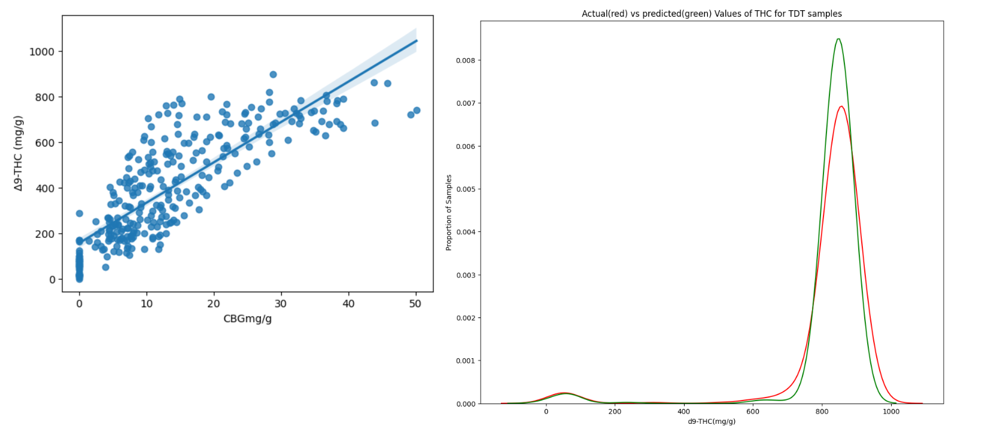
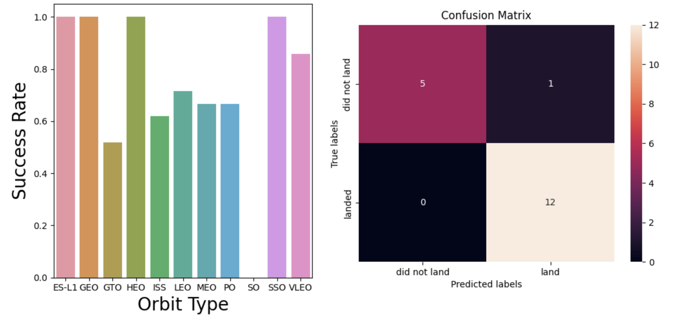
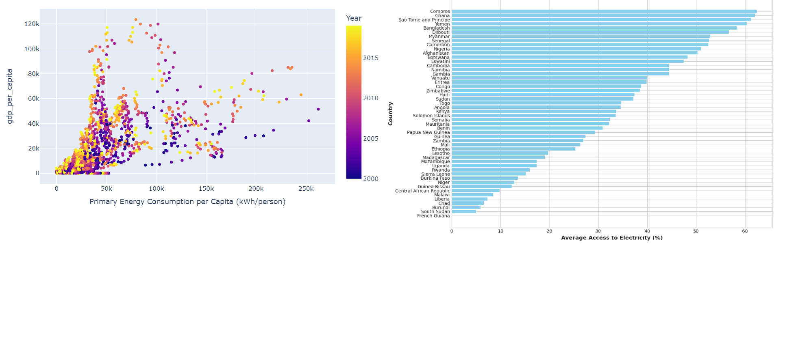

## Femi's Portfolio

### Project 1: [Predictive Modeling of THC Values Based on CBN Results for Distillates](https://www.kaggle.com/code/femiolawale/distillate-potency-prediction?scriptVersionId=145139556)

Overview 
- In this project, we have successfully addressed the pressing issue of THC inflation in the cannabis industry by developing a highly accurate predictive model that utilizes Cannabinol (CBN) values to predict delta-9-tetrahydrocannabinol (THC) content in cannabis distillates. With a remarkable 92% accuracy rate and well within the margin of error, this model not only serves as a robust check against inflated THC data generated by testing laboratories but also identifies instances where THC values deviate from expected norms. By doing so, it provides a vital quality assurance mechanism for testing laboratories, promotes transparency, and empowers industry stakeholders to make informed decisions. This innovative approach not only safeguards consumer trust and satisfaction but also contributes to the establishment of rigorous industry standards, ensuring the continued growth and integrity of the cannabis market.

### Project 2: [Winning Space Race with Data Science](https://github.com/olafem/oluwafemi/blob/master/SpaceX%20Capstone%20Project_Femi.pdf)

Overview 
- The objective of this project is to predict the successful landing of the first stage in SpaceX Falcon 9 rocket launches, a crucial factor impacting launch cost. Key variables including payload mass, orbit type, booster type, and launch site were assessed for their influence on landing success. Additionally, we examined the geographical factors, such as proximity to coastlines, cities, and the equator, as potential indicators of success. Our predictive analysis reveals a remarkable 94% certainty in the successful landing of the Falcon 9 first stage. To enhance these odds, further optimization and fine-tuning of essential parameters, such as booster type and payload mass, should be considered.

### Project 3: [Empowering the Future: Navigating Global Sustainability with Data-Driven Insights](https://www.kaggle.com/code/femiolawale/global-sustainable-energy?scriptVersionId=146179838)

Overview 
- Our project delves into two decades of comprehensive data to understand and predict the future of sustainable energy. We've successfully developed models to forecast energy consumption, while also classifying countries into low, medium, and high access to electricity categories. These insights are instrumental in shaping global sustainability strategies and driving policy decisions and investments.
With a keen eye on Sustainable Development Goal 7, we've contributed to the mission of universal, reliable, and affordable energy access. Our project not only aids in guiding sustainable investments but also offers a foundation for assessing energy equity and efficiency. As the world leans towards a cleaner and more equitable energy landscape, our project opens doors to a brighter, more sustainable future for all.

