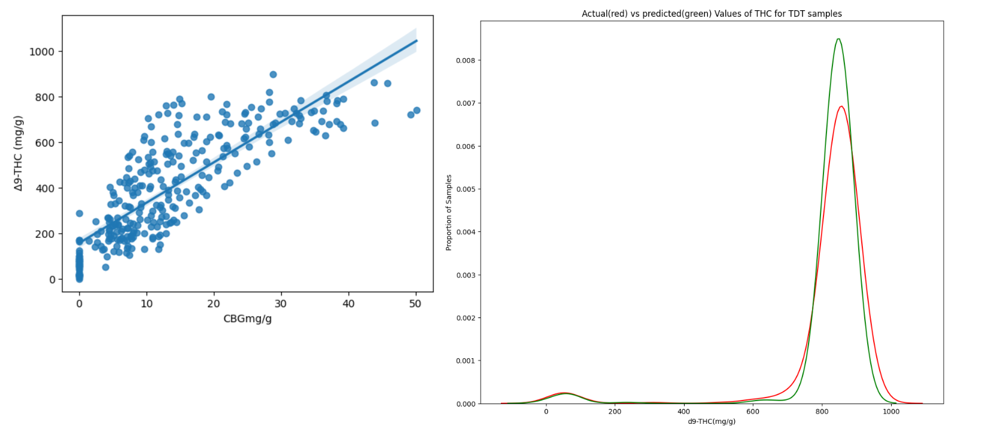

## My Portfolio

---

### Data Science 

Project 1: [Predictive Modeling of THC Values based on CBN Results for Distillates](https://www.kaggle.com/code/femiolawale/distillate-potency-prediction?scriptVersionId=145139556)

---
Project 2: [Winning Space Race with Data Science](https://github.com/olafem/oluwafemi/blob/master/SpaceX%20Capstone%20Project_Femi.pdf)

---
Project 3: [Empowering the Future: Navigating Global Sustainability with Data-Driven Insights](https://www.kaggle.com/code/femiolawale/global-sustainable-energy?scriptVersionId=146179838)

---

### Course Projects

- [Tableau Projects](https://public.tableau.com/app/profile/oluwafemi.olawale)
- [Power BI Projects](https://app.powerbi.com/links/VdutdIRLLy?ctid=4a1e5cee-f43e-451d-b150-1486f954ef55&pbi_source=linkShare)

---

