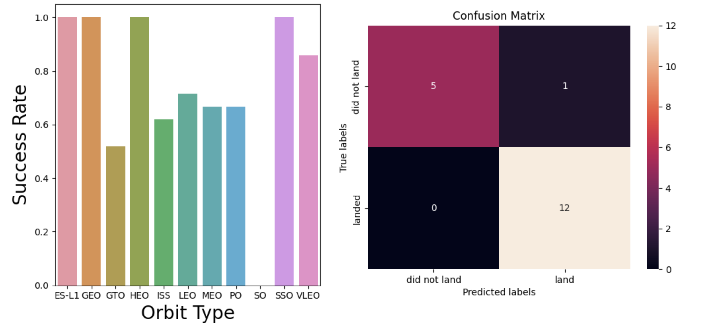

## My Portfolio

---

### Data Science 

Project 1: [Optimizing Inventory and Operations: A Data-Driven Approach for Mint Classics](https://github.com/olafem/oluwafemi/blob/9a9e5b625417671637c21bc167093f0d2c1ccbc5/MintClassicsProject.sql)

https://github.com/olafem/oluwafemi/blob/68c3143ddf87353778aa6a6df75a6a862a83e40d/images/mintpopularity.JPG

Project 2: [Predictive Modeling of THC Values Based on CBN Results for Distillates](https://github.com/olafem/oluwafemi/blob/c32429bb402554680e5c26cda5d8d1f7cf74e2c7/distillate-potency-prediction%20(2).ipynb)

[Kaggle link here](https://www.kaggle.com/code/femiolawale/distillate-potency-prediction?scriptVersionId=145139556)

---
Project 3: [Winning Space Race with Data Science](https://github.com/olafem/oluwafemi/blob/master/SpaceX%20Capstone%20Project_Femi.pdf)

---
Project 4: [Empowering the Future: Navigating Global Sustainability with Data-Driven Insights](https://github.com/olafem/oluwafemi/blob/90815506df26058b31007e901f986a0025c7e2a4/global-sustainable-energy%20(1).ipynb)

[Kaggle link here](https://www.kaggle.com/code/femiolawale/global-sustainable-energy)

---
Project 5: [Toronto Raptors Performance vs Major Rival](https://github.com/olafem/oluwafemi/blob/b6a537dbc044e20baac612acf0429bba59c3fb01/NBA%20Team%20Performance.ipynb)

---
### Hands-on Course Projects
- [Customer Behaviour Analysis with SQL and Tableau](https://public.tableau.com/views/CustomerBehaviourAnalysiswithSQLandTableau/Overview?:language=en-US&:display_count=n&:origin=viz_share_link)
- [Tableau Projects](https://public.tableau.com/app/profile/oluwafemi.olawale)
- [Power BI Project](https://app.powerbi.com/links/VdutdIRLLy?ctid=4a1e5cee-f43e-451d-b150-1486f954ef55&pbi_source=linkShare)

---

